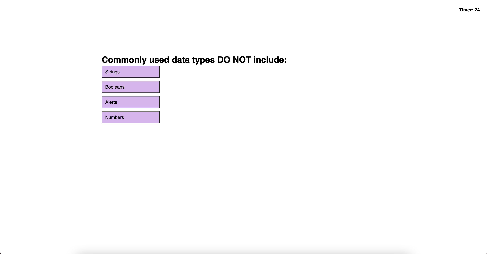

# coding-quiz

## Description

This Coding Quiz tests the user's knowledge of coding with a simple quiz. This quiz gives multiple choices to each question and then logs the score as the amount of time left in the quiz when it was finished.

## Installation

No steps involved. Just follow this link:

## Usage
Follow the prompts to take the quiz. Once you finish the questions, enter your initials into the prompt and submit. You will then be shown the leaderboard with your initials and score.
    

## Credits

Tutoring Session on September 17, 2023

Links to Resources Used as Reference:
https://stackoverflow.com/questions/29884654/button-that-refreshes-the-page-on-click
https://developer.mozilla.org/en-US/docs/Web/HTML/Element/input
https://www.tutorialrepublic.com/faq/how-to-add-a-class-to-a-given-element-in-javascript.php
https://www.w3schools.com/jsref/met_document_createelement.asp
https://www.geeksforgeeks.org/how-to-remove-an-html-element-using-javascript/

